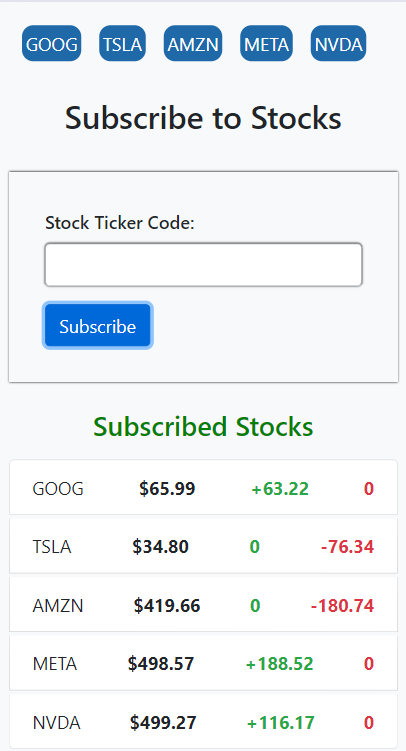

# Stock Broker Client Web Dashboard


## Overview

The Stock Broker Client Web Dashboard is an interactive platform where users can subscribe to stock tickers and receive real-time updates on stock prices. The application is designed to provide a seamless and intuitive user experience, allowing users to monitor stock prices and see changes in real-time.

## Features

- **User Authentication:** Users can log in using their email.
- **Stock Subscription:** Users can subscribe to predefined stock tickers such as GOOG, TSLA, AMZN, META, and NVDA by clicking on the respective buttons.
- **Custom Stock Subscription:** Users can subscribe to any other stock ticker by entering the ticker code and pressing the "Subscribe" button.
- **Real-time Updates:** Stock prices update every second, showing the difference between the current value and the initial value in green or red color to indicate gains or losses.

## Getting Started

### Prerequisites

- A web browser

### Installation

1. Clone the repository:

   ```bash
   git clone https://github.com/riyaj-kalegar03/Assignment-2.git
   cd Assignment-2
   ```

2. Open `index.html` in your preferred web browser.

### Usage

1. Open `index.html` in your browser.
2. Log in using your email.
3. Subscribe to stock tickers by clicking on the predefined buttons or entering a custom ticker code and pressing "Subscribe".
4. Monitor real-time stock prices and observe the price changes indicated in green (gain) or red (loss).

### File Structure

- `index.html` - The main HTML file.
- `style.css` - The CSS file for styling.
- `script.js` - The JavaScript file for handling interactions and real-time updates.

### Screenshots




## Contributing

Contributions are welcome! Please open an issue or submit a pull request for any improvements or additions.
